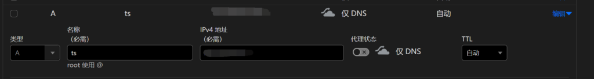
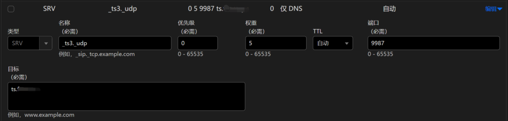

## **Step 1：准备工作**

### 1. 下载 **TS3 客户端**

[TS3 客户端下载地址](https://www.teamspeak.com/zh-CN/downloads/#ts3client)

请注意：`TS3中文站`不是官方，请点击以上链接去官网下载！

### 2. 下载 **中文语言包**

[中文包 GitHub 地址](https://github.com/VigorousPro/TS3-Translation_zh-CN) (安装完TS3客户端后直接双击点击Install，然后重启TS3客户端即可)

### 3. 在服务器上安装 `Docker` 和 `Docker-Compose`

#### **安装 Docker**

可以通过 `yum` 等包管理工具直接安装。

配置镜像加速：

```
vim /etc/docker/daemon.json
```

写入以下内容：

```
{
  "registry-mirrors": [
    "https://docker.1panel.live",
    "https://docker.mirrors.ustc.edu.cn",
    "https://hub-mirror.c.163.com",
    "https://mirror.baidubce.com",
    "https://registry.cn-hangzhou.aliyuncs.com"
  ]
}
```

完成后执行以下命令：

```
sudo systemctl daemon-reload
sudo systemctl restart docker
docker info
```

验证是否成功：

```
Registry Mirrors:
  https://docker.1panel.live/
  https://docker.mirrors.ustc.edu.cn/
  https://hub-mirror.c.163.com/
  https://mirror.baidubce.com/
  https://registry.cn-hangzhou.aliyuncs.com/
```

#### **安装 Docker-Compose**

由于国内镜像站下架，需要手动下载安装：

1. 查看系统架构：

```
   uname -m
```

1. 前往 [Docker-Compose 发布页](https://github.com/docker/compose/releases)，离线下载对应系统架构的执行文件。
2. 上传到服务器并完成安装：

```
sudo mv docker-compose-linux-x86_64 /usr/local/bin/docker-compose
sudo chmod +x /usr/local/bin/docker-compose
docker-compose --version
```

示例输出：

```
Docker Compose version v2.32.0
```

------

## **Step 2：搭建 TeamSpeak 服务器**

### **第一步：创建工作目录**

1. 创建存储数据的目录：

```
mkdir -p /opt/teamspeak/teamspeak_data
mkdir -p /opt/teamspeak/mariadb_data
```

1. 切换到工作目录：

```
cd /opt/teamspeak
```

------

### **第二步：创建 `docker-compose.yml` 配置文件**

1. 创建 `docker-compose.yml` 文件：

```
vim docker-compose.yml
```

1. 填入以下内容：

```
version: '3.1'
services:
 teamspeak:
   image: teamspeak:3.13.7
   restart: always
   ports:
     - 9987:9987/udp
     - 10011:10011
     - 30033:30033
   volumes:
     - ./teamspeak_data:/var/ts3server
   environment:
     TS3SERVER_DB_PLUGIN: ts3db_mariadb
     TS3SERVER_DB_SQLCREATEPATH: create_mariadb
     TS3SERVER_DB_HOST: db
     TS3SERVER_DB_USER: root
     TS3SERVER_DB_PASSWORD: example_password
     TS3SERVER_DB_NAME: teamspeak
     TS3SERVER_DB_WAITUNTILREADY: 30
     TS3SERVER_LICENSE: accept

 db:
   image: mariadb:11.0.3
   restart: always
   volumes:
     - ./mariadb_data:/var/lib/mysql
   environment:
     MYSQL_ROOT_PASSWORD: example_password
     MYSQL_DATABASE: teamspeak
```

**注意：**

- 将 `example_password` 替换为你的实际密码。
- `TS3SERVER_DB_NAME` 和 `MYSQL_DATABASE` 的值必须为 `teamspeak`。

------

### **第三步：启动 TeamSpeak 和 MariaDB 服务**

1. 启动服务：

```
docker-compose up -d
```

1. 检查服务状态：

```
docker-compose ps
```

正常运行的输出示例：

```
Name                     Command               State            Ports
--------------------------------------------------------------------------------
teamspeak_teamspeak_1    /opt/ts3server/ts3server ...   Up      0.0.0.0:9987->9987/udp
teamspeak_db_1           docker-entrypoint.sh mysqld ...   Up      3306/tcp
```

------

### **第四步：开放防火墙端口**

1. 开放以下 TeamSpeak 所需的端口：

```
sudo firewall-cmd --permanent --add-port=9987/udp
sudo firewall-cmd --permanent --add-port=10011/tcp
sudo firewall-cmd --permanent --add-port=30033/tcp
sudo firewall-cmd --reload
```

1. 验证防火墙配置是否生效：

```
   sudo firewall-cmd --list-all
```

------

### **第五步：首次登录并设置管理员**

1. 查看容器日志：

```
docker-compose logs -f
```

1. 从日志中获取首次启动信息，日志中包含以下重要信息，请妥善保存：

- `Server Query 管理员账号和密码`
- 管理员 `token`

示例日志内容：

```
teamspeak-1  | ------------------------------------------------------------------
teamspeak-1  |                       I M P O R T A N T
teamspeak-1  | ------------------------------------------------------------------
teamspeak-1  |                Server Query Admin Account created
teamspeak-1  |          loginname= "serveradmin", password= "XXXXXXXXXXXXX"
teamspeak-1  |          apikey= "BAB4XXXXXXXXXXXXXXXXXXXXXXXXXXXX"
teamspeak-1  | ------------------------------------------------------------------

teamspeak-1  | ------------------------------------------------------------------
teamspeak-1  |                       I M P O R T A N T
teamspeak-1  | ------------------------------------------------------------------
teamspeak-1  |       ServerAdmin privilege key created, please use it to gain
teamspeak-1  |       serveradmin rights for your virtualserver. please
teamspeak-1  |       also check the doc/privilegekey_guide.txt for details.
teamspeak-1  |        token=56THDpXXXXXXXXXXXXXXXXXXXXXXXXXXX
teamspeak-1  | ------------------------------------------------------------------
```

1. 使用 TeamSpeak 客户端连接到服务器时，输入 `token`，账号将成为管理员。

------

### **第六步：维护与管理**

1. 查看运行日志：

```
docker-compose logs -f
```

1. 停止服务：

```
docker-compose down
```

1. 重启服务：

```
docker-compose up -d
```

1. 如需查找日志信息，可以从 `./data/logs` 下找到。

------

## **Step 3：域名解析（以 CloudFlare 为例）**

### **1. 添加 A 类型规则**

指向服务器 IP 地址。



### **2. 添加 SRV 类型规则**

